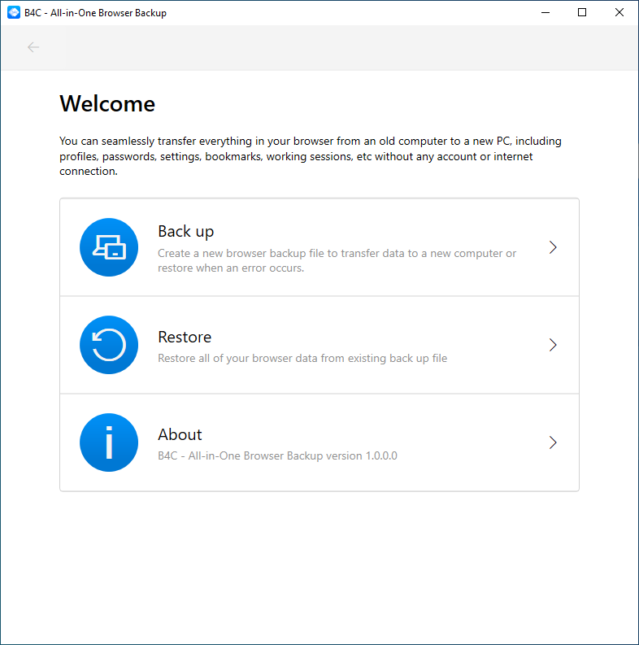
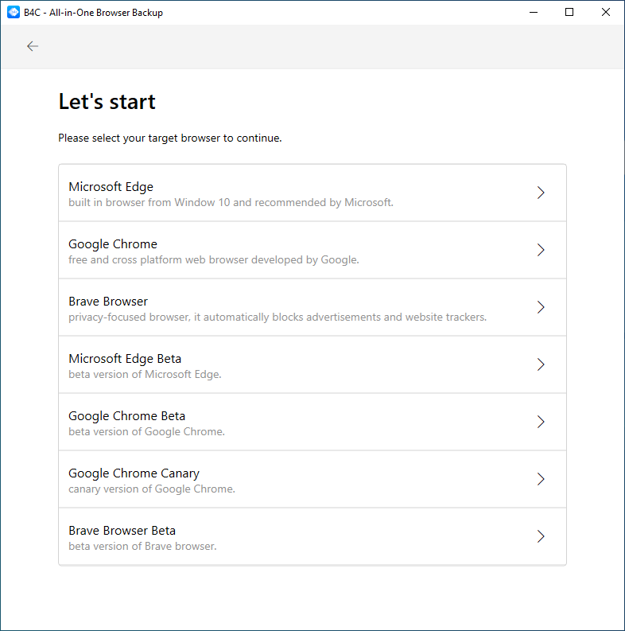

# B4C - All-in-One Browser Backup
B4C - All in one Browser Backup and Transfer helps to transfer browsers data between computers.
B4C - All in one Browser Backup and Transfer supports almost all of Chrominum based browser, includes Microsoft Edge, Google Chrome, Brave, etc.

## Features
- Backup and transfer full data of browser includes passwords, settings, extensions, etc.
- Backup and transfer browser data offline
- No internet and no sync account requirement.
- Unlimited number of profiles
- Support various browsers, includes Microsoft Edge, Google Chrome, Brave, etc
- No data collection, only save your browser data in your storage
  
## Screenshot and Media

 
 

## Download and Installation
B4C - All in one Browser Backup and Transfer is available Microsft Store only at https://www.microsoft.com/store/apps/9MVLMN5XWHKP

## Privacy
The application B4C - All-in-One Browser Backup (now called application) an application helps to transfer browser data between computers.

What Data We Collect and Process: The application B4C - All-in-One Browser Backup does not collect, store or transit any personal personal data. 
The app does not use any own telemetry functions apart from the standardised telemetry functions by Microsoft (crashes, install from which country, versions in use, custom events etc.)

## FAQ

